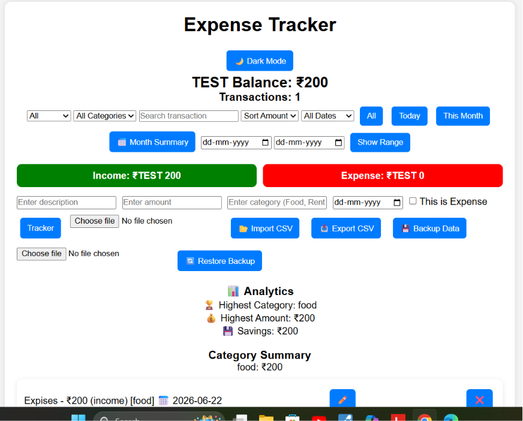

## Screenshot

# Income & Expense Tracker

## Live Demo

[View Expense Tracker](t https://abhi12012.github.io/expense-tracker/)
A simple and practical Income & Expense Tracker application built using HTML, CSS, and JavaScript.

This project helps users manage income and expenses, track transactions, monitor financial activity, backup and restore data, export and import records, and analyze spending patterns.

---

# Features

## Transaction Management

* Add income transactions
* Add expense transactions
* Edit transactions
* Delete transactions
* View transaction history
* Search transactions by description
* Track income and expense records easily

---

## Financial Summary

* Automatic balance calculation
* Total income summary
* Total expense summary
* Current balance tracking
* Transaction counter

---

## Monthly Summary

* View monthly income summary
* View monthly expense summary
* Calculate monthly balance
* Analyze monthly transaction data
* Track monthly financial activity
* Better monthly financial organization

---

## Transaction Filtering

### Type Filter

* All Transactions
* Income
* Expense

### Date Filter

* Today
* This Month
* All Transactions
* Custom Date Range Filter
* Select transactions between two dates

---

## Sorting System

* Sort transactions by amount
* High to Low amount sorting
* Low to High amount sorting
* Improved transaction analysis

---

## Category Management

* Category-based transaction organization
* Category Filter
* Category Summary
* View total transactions by category
* Better expense analysis

---

## Analytics & Visualization

* Category Chart visualization
* Category-wise expense analysis
* Percentage-based category distribution
* Highest spending category
* Highest category amount calculation
* Better spending insights

---

## Data Management

* Data saved using Local Storage
* Transactions remain after page refresh
* Deleted transactions removed from Local Storage
* Prevent duplicate transaction descriptions
* Input validation

---

## Export & Import System

* Export transactions as CSV file
* Import transaction data
* Download transaction records for external use
* Easy data backup and management

---

## Backup & Restore System

* Create transaction backup
* Restore previous transaction data
* Protect important financial records
* Recover data when needed
* Safe data management system

---

## Alert & Validation System

* Alert messages for user actions
* Confirmation before deleting transactions
* Warning for invalid inputs
* Prevent empty transaction entries
* Improved user experience

---

# Updates & Changelog

## Version 2.0 - Backup, Restore & Data Management Update

Added:

* Added Backup System
* Added Restore System
* Added Import Data feature
* Improved Export functionality
* Added user alerts and confirmations
* Improved data safety and management
* Enhanced overall application experience

---

## Version 1.9 - Monthly Summary Update

Added:

* Added Monthly Summary section
* View monthly income and expenses separately
* Added monthly balance calculation
* Improved monthly financial analysis
* Added better data organization without affecting existing transactions

---

## Version 1.8 - Income & Expense Tracker Update

Added:

* Improved income and expense tracking system
* Added better financial record management
* Enhanced income and expense monitoring
* Improved transaction management experience

---

## Version 1.7 - Date Range Filter Update

Added:

* Added Custom Date Range Filter
* Select start date and end date
* View transactions between selected dates
* Improved date-based transaction analysis
* Enhanced filtering system

---

## Version 1.6 - Analytics Update

Added:

* Added Analytics section
* Added highest spending category analysis
* Added highest category amount calculation
* Improved spending insights

---

## Version 1.5 - Chart Visualization Update

Added:

* Added Category Chart visualization
* Added percentage-based category analysis
* Added chart headings for better understanding
* Improved chart presentation

---

## Version 1.4 - CSV Export & Sorting Update

Added:

* Added CSV Export feature
* Download transaction data as CSV file
* Added Amount Sorting feature
* Sort transactions from High to Low
* Sort transactions from Low to High

---

## Version 1.3 - Search & Category Update

Added:

* Added Search Transactions feature
* Search transactions by description
* Added category-based organization
* Improved transaction finding system

---

## Version 1.2 - Date Filter Update

Added:

* Added transaction date selection feature
* Added Today filter
* Added This Month filter
* Added All Transactions filter

---

## Version 1.1 - Filtering Update

Added:

* Added transaction filtering system
* Added category management
* Improved transaction management

---

## Version 1.0 - Initial Release

Added:

* Basic income and expense tracking
* Add and delete transactions
* Local Storage support

---

# Technologies Used

* HTML
* CSS
* JavaScript

---

# Future Updates

* Dashboard
* Advanced Charts & Analytics
* Dark Mode
* Backend Integration
* User Authentication
* Cloud Data Synchronization

---

# Author

Abhishek

